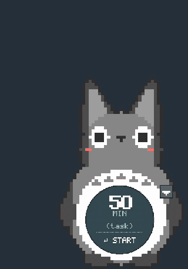
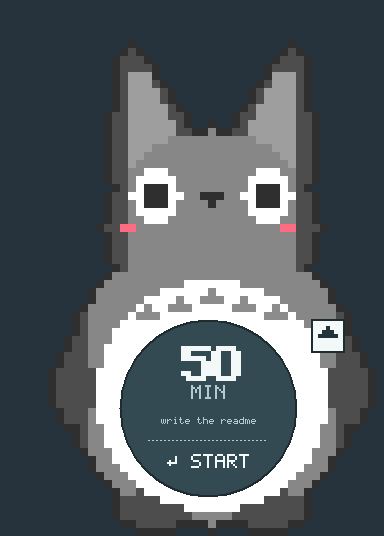

# Pomotoro

A pixel Totoro who sits in the corner of your desktop and times your focus
sessions.

[](https://github.com/JoshuaWongs/pomotoro/actions/workflows/tests.yml)



Got inspired by [Tina Huang's fun pomodoro timer](https://www.youtube.com/watch?v=sbmP6i-MChk)
so built my own to keep me on task!

He lives in the bottom-right corner of the screen with a clock face on his
belly. Type a length, type what you are working on, press start. When the time
runs out he loses his temper and bursts into camphor leaves.

## What you need

- **Windows.** The see-through background, the window layering, the sound and
  the single-copy check are all Windows-specific. He will not run on macOS or
  Linux.
- **Python 3.9 or newer**, which is probably already on your machine. The
  installer from [python.org](https://www.python.org/downloads/) includes
  everything needed.

Nothing else. No `pip install`, no dependencies, no build step. The whole thing
is the Python standard library.

## Running him

```
git clone https://github.com/JoshuaWongs/pomotoro.git
cd pomotoro
python pomodoro.py
```

He appears in the bottom-right corner. That is the entire setup.

To run him without a console window hanging around, use `pythonw` instead of
`python`.

<details>
<summary>Rather hand it to an AI agent than read instructions?</summary>

Paste this:

> Clone https://github.com/JoshuaWongs/pomotoro and set it up on my machine.
> Read AGENTS.md first. It is Windows-only and needs no dependencies.

[AGENTS.md](AGENTS.md) has the build, test and convention detail agents need.

</details>

## Using him



**Setting a timer.** Click the big number on his belly and type. The cursor
lands where you clicked, so you can click between the 5 and the 0 of `50` and
type there. Arrow keys, Home and End move it; Backspace and Delete work either
side of it. Click the `(task)` line below and type what you are working on,
then click `START` or press Enter. Nothing blinks until you click into a field.

**Typing the time.** A plain number means minutes, so `25` is 25 minutes. A dot
splits minutes from seconds:

| You type | You get |
|---|---|
| `50` | 50 minutes |
| `.3` | 30 seconds |
| `.45` | 45 seconds |
| `5.3` | 5 minutes 30 seconds |

One digit after the dot means tens of seconds. Two digits are exact.

**While it runs.** The belly becomes a clock face. The pale slice grows as time
is used up, dark is what is left. There are no buttons on the belly — click
anywhere on it to pause, click again to carry on.

**Starting over.** A small circular arrow appears on his side while a timer is
running. It throws the timer away and puts him back to the standard screen: 50
minutes, no task. Escape does the same.

**When it finishes.** He loses his temper. He comes to the front of everything,
the clock face vanishes, his brows crash down, and over a couple of seconds he
swells by about a third while turning steadily red and shaking harder. Then he
pops, and out comes the forest: camphor leaves thrown up and fluttering back
down, acorns tumbling, and a scatter of soot sprites blinking their white eyes
before drifting away. Those are his three things in the film — the acorns he
gives the girls, the tree he lives in, and the susuwatari.

A beep sounds every half second right up to the moment he pops, then a low
crunch as he does.

He grows out of the corner, up and to the left, so he never swells off the edge
of the screen. Clicking him, or pressing Return, cuts the tantrum short and
drops him straight back to the next timer.

**He always ends up in front.** Whatever the arrow said before, a finished timer
brings him out and leaves him there, so you cannot miss one. Put him back behind
your windows with the arrow when you are done.

**The next pomodoro is already loaded.** Finish a 50 minute block and he comes
back showing 10 minutes, labelled `break`. Finish the break and your 50 minutes
and its task are waiting again. A break is a fifth of the focus block, so 25
gives 5. Nothing starts on its own — press start when you are ready. The
circular arrow throws the queue away and goes back to 50.

**The small button on his side.** This controls whether he stays visible.

- `▲` — he floats above every window, always in sight.
- `▼` — he sits on the desktop, so opening a window covers him up.

Either way he jumps to the front when a timer finishes, so you never miss one.
The setting is remembered in `state.json` next to the code.

## Getting him back when he is hidden

With the arrow down he sits behind your windows, which is the point, but it
means you would have to clear the screen to reach him. You do not: **run him
again and the copy already running comes to the front**, arrow up, ready to
use. A second copy never starts.

That makes a shortcut into a button for him. Create one pointing at
`pythonw pomodoro.py`, pin it to your taskbar, and clicking it fetches him
whenever he is buried. `totoro.ico` is in the repo for the shortcut's icon — it
is drawn wider than his true proportions on purpose, because he is a tall
narrow shape and at honest proportions he looked thinner than everything else
on the taskbar.

To have him appear at login, put a shortcut in your Startup folder: press
Windows+R, type `shell:startup`, press Enter, and drop it in there. **He does
not do this himself** — see below.

## He installs nothing

Worth saying plainly, since you are being asked to download and run a script:

- No dependencies. 16 standard-library modules and nothing else.
- **No network access of any kind.** There is no HTTP, socket or URL code in
  the project. It cannot phone home because it has nothing to phone with.
- No registry writes, no Startup entries, no shortcuts created. If you want him
  at login you make that shortcut yourself.
- He writes two things and nothing else: `state.json` beside the code, which
  remembers which way his arrow points and can be deleted any time, and the two
  short sound files, in a private temporary directory made fresh each run.
- No `eval`, `exec`, `subprocess` or `pickle` anywhere, and no code is loaded
  at runtime from anywhere.
- The Windows calls he does make are all through `ctypes`, and all of them are
  about placing a window: the usable screen area, the display scaling, the
  stacking order, and a named lock so a second copy bows out instead of
  stacking up in the corner.

Uninstalling is deleting the folder.

## Sessions are not recorded

He writes nothing down about your work. No log file, no folder, nothing.

The writer for it is built and tested, just switched off, so turning it on is a
one-line change. In `pomodoro.py`, point `LOG_SESSIONS` at a folder:

```python
LOG_SESSIONS = r"C:\Users\you\Notes\Pomodoro"
```

Finished sessions then append to one note per month, in Obsidian's Dataview
inline-field format:

```
## 2026-09-08
- (pomodoro:: WORK) (duration:: 50m) (task:: review deck) (end:: 2026-09-08 15:58)
- (pomodoro:: BREAK) (duration:: 10m) (task:: break) (end:: 2026-09-08 16:08)
```

The `pomodoro::` field is the part that matters. Breaks and focus blocks land in
the same file, so with no field saying which is which, any total you query is
inflated by every break you took. With it, a query can ask for focus alone:

```dataview
TABLE duration, task WHERE pomodoro = "WORK"
```

## Tests

```
python pomodoro.py --selftest
python test_timer.py
```

The first is quick: timer maths, the duration parser, the log format, the
bitmap font, the sprite geometry, the icon container, the synthesised sounds,
and that the widget still builds — a missing colour or a typo in the drawing
code is invisible to every other check and only shows up on launch.

The second has 20 sections and drives real clicks at real coordinates: pausing,
resetting, mashing the buttons in random order, the caret landing where you
clicked, the progress slice agreeing with the digits to within a twentieth of a
degree, the beeps not drifting, and the tantrum leaving nothing behind.

**What the badge covers.** CI runs the self-test on Python 3.9, 3.11 and 3.13
on Windows. It does not run `test_timer.py`, which measures beep timing against
the wall clock and would flake on a shared machine, and it skips the one check
that needs a real sound card. Those two run locally.

## How it is built

[DESIGN.md](DESIGN.md) is the long version: why the progress slice is a polygon
rather than a pie arc, why the beeps are timed against a fixed schedule, why
Totoro is drawn in code from ellipses instead of loaded from an image, and the
list of bugs that each of those decisions exists to prevent.

The short version: about 1400 lines of Python, no dependencies, a hand-drawn
5x7 pixel font because Windows ships no pixel typeface, and a frameless
transparent window positioned with Win32 calls through `ctypes`.

## Credits

The layout is modelled on the pixel avocado timer in Tina Huang's
[Learn 10X Faster In 10 Minutes](https://www.youtube.com/watch?v=sbmP6i-MChk)
(around 8:50) — a chunky character with the clock on his belly, a MIN label, a
task line, a dotted rule and START. The beep pitch and spacing were measured
from that video rather than guessed.

Totoro is a character created by Hayao Miyazaki and owned by Studio Ghibli.
This is unaffiliated fan art, made for my own desk. The [MIT license](LICENSE)
covers the code in this repository, not the character design.
